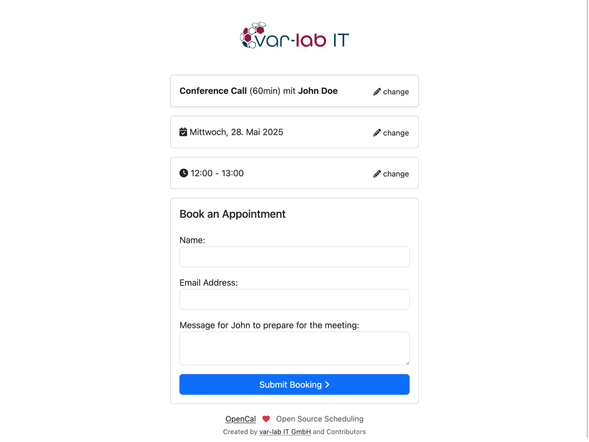

# OpenCal - Open Source Appointment Scheduling Platform

**OpenCal** is a modern, open-source web application that simplifies and streamlines the process of scheduling
appointments.
It’s ideal for anyone who organizes meetings and wants to save time, whether they are self-employed, part of a
team or employed by a company.
Due to its open license, OpenCal can be used, customized, and self-hosted free of charge. It is also suitable for
professional and commercial use in businesses.

The backend is written in Symfony and the API Platform, and it provides a RESTful API that the Vue front end uses. The
API can also be integrated into other software applications.



## Configuration

Both backend and frontend Docker containers can be customized using environment variables.

### Frontend Environment Variables

| Variable            | Description                                           | Default Value           |
|---------------------|-------------------------------------------------------|-------------------------|
| `VITE_APP_LANGUAGE` | Defines the default language/locale for the frontend. | `en_GB`                 |
| `VITE_API_HOST`     | Specifies the backend API's base URL.                 | `http://localhost:8080` |
| `VITE_LOGO_URL`     | URL to your logo.                                     | <empty>                 |

### Backend/API Environment Variables

| Variable                  | Description                                     | Default Value                           |
|---------------------------|-------------------------------------------------|-----------------------------------------|
| `LOCALE`                  | The locale.                                     | `en_GB`                                 |
| `EMAIL_SENDER_ADDRESS`    | The e-mail address from which e-mails are sent. | `mail@example.tld` (please change this! |
| `EMAIL_SENDER_NAME`       | The name of the sender of e-mails               | `OpenCal`                               |
| `MAILER_DSN`              | Mailer configuration                            | `smtp://mailer:1025` (MailPit)          |
| `MESSENGER_TRANSPORT_DSN` | Messenger transport configuration               | `doctrine://default?auto_setup=0`       |
| `FRONTEND_DOMAIN`         | Domain of the frontend.                         | `localhost`                             |
| `USE_SSL`                 | If true, https will be used.                    | `true`                                  |

## Local Development

### Prerequisites

- Docker
- Docker Compose

### Pull the repository

```bash
git clone git@github.com:var-lab-it/opencal.git
```

### Starting the Application

```bash
make up
```

**Frontend** → http://localhost
**Backend (API docs)** → http://localhost:8080  
**Mailpit** → http://localhost:8025

## Common Commands

### All

| Action                  | Command     |
|-------------------------|-------------|
| Stop containers         | `make down` |
| Show running containers | `make ps`   |

### Backend (Symfony)

| Action                       | Command                    |
|------------------------------|----------------------------|
| Start project                | `make up`                  |
| Build PHP container          | `make backend.build`       |
| Open shell in backend        | `make backend.sh`          |
| Run PHPUnit tests            | `make backend.phpunit`     |
| Load fixtures                | `make backend.fixtures`    |
| Recreate DB schema           | `make backend.db.recreate` |
| Run migrations               | `make backend.migrate`     |
| Install backend dependencies | `make backend.install`     |

**Direct Symfony Console Example**:

```bash
docker compose exec php_backend bin/console doctrine:migrations:migrate
```

### Generate data for Radicale (CalDAV)

To generate some test data for CalDAV (Radicale service in docker-compose.yml), there is a script do so:

What it does
- Creates 4 events/day (09:00, 11:00, 14:00, 16:00 UTC)
- For 30 days starting today
- Saves each event as an individual .ics file (e.g. `meeting-001@examplecorp.com.ics`)
- Output directory: `dev/caldav/data/collections/collection-root/dev/example`

.Radicale.props in that folder is preserved; all meeting-*.ics files are replaced.

#### Usage:

```bash
bash generate-ics.sh
```

or

```bash
make ics
```

### Frontend (Vue.js)

| Action                 | Command                 |
|------------------------|-------------------------|
| Build production image | `make frontend.build`   |
| Open development shell | `make frontend.sh`      |
| Install dependencies   | `make frontend.install` |
| Run ESLint             | `make frontend.lint`    |
| Run security audit     | `make frontend.audit`   |

**Dev server** starts automatically with `make up` and is available at [http://localhost](http://localhost).

## Linting & Security

ESLint and npm audit checks are automatically run via GitHub Actions.

Manual checks:

```bash
make frontend.lint
make frontend.audit
```

## Production Build

The `frontend` service uses a **multi-stage Dockerfile** to produce a lightweight NGINX container for production.

```bash
make frontend.build
```

The Symfony backend uses a similar multi-stage Dockerfile for optimized production builds.

## Useful Commands

```bash
# Symfony console (example)
docker compose exec php_backend bin/console

# MySQL CLI
docker compose exec database mysql -u symfony -psymfony symfony
```

## Mailpit

All emails sent by the application will appear at [http://localhost:8025](http://localhost:8025).

## 🔧 Build All Services

```bash
make build
```

This builds the PHP backend, the NGINX server, and the frontend production image.

## 🤝 Contributing

Contributions are welcome! Please follow the existing code style and ensure all code passes linting and security checks.
